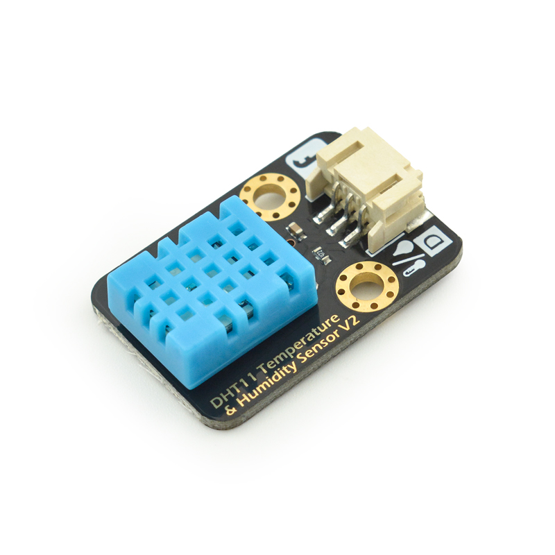
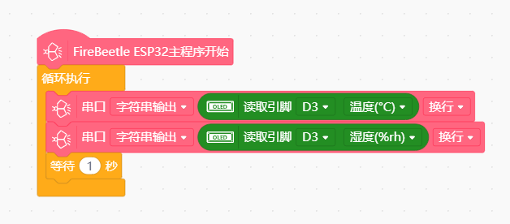

# 基于esp32的dht11传感器




---------------------------------------------------------

## Table of Contents

* [URL](#url)
* [Summary](#summary)
* [Blocks](#blocks)
* [License](#license)
* [Supported targets](#Supportedtargets)

## URL
* Project URL : ```https://github.com/blackksy008/esp32_dht11```


## Summary
主要用于这次上课，因为esp32主控板没有dht11传感器，基于此临时开发使用

## Blocks


## Examples



## License

MIT

## Supported targets

MCU                | JavaScript    | Arduino   | MicroPython    | Remarks
------------------ | :----------: | :----------: | :---------: | -----
esp32        |             |       √       |             | 


## Release Logs
* V0.0.1  Basic functions completed.